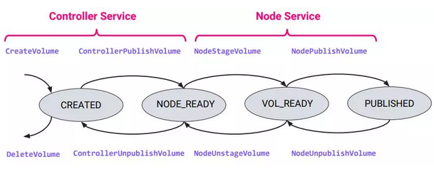

## csi 白皮书

### 简介

- 组件介绍

缩写词 | 含义
--- | ---
CO | 容器编排系统
SP | 存储供应商
Volume | CO 管理的容器中 存储单元
Mounted Volume | 使用指定的文件系统挂载，并显示为容器内目录
Node | 用户工作负载运行主机，通过节点ID唯一标识
Workload | CO调度的原子单元，可以是容器或一组容器
Plugin | 实现grpc的csi服务

- csi: (container storage interface),🈶k8s,docker,mesos等联合制定的接口规范
- 业界应用： Kubernetes 1.9实现了CSI plugin alpha版本，1.11版本已升至Beta，Mesos 1.6已经支持CSI Spec 0.2版本。同时，各存储厂商或云服务提供商，如OpenSDS、RBD、GCE等，也相应发布了CSI plugin
### 设计介绍

- in-tree vs. out-tree
    - 与CO完全解耦
    - SP负责插件设计，开发和测试
- service vs. cli 
    - 相比cli，service更易部署
    - 部署cli需主机root权限
    - 基于FUSE（用户空间文件系统）后端需长时间运行
- api设计原则
    - 所有api调用幂等
    - 采用gRPC协议    
    - 采用同步API
    
### 技术架构
- 每个SP要提供两个plugin
    - node plugin： 运行使用volume的node，负责volume mount/unmount 
    - controller plugin, 任何节点，负责volume create/delete, attach/detach

- volume 生命周期，包含了关于volume的所有操作，SP plugin可选择实现

### csi spec解释 
- 基于3.0 介绍，主要分为三部分
- Identity Service：Node Plugin和Controller Plugin都必须实现这些RPC集。
- Controller Service：Controller插件必须实现这些RPC集。
- Node Service：node插件必须实现这些RPC集。

#### Identity
- 查询插件的功能，健康状况和其他元数据
- GetPluginInfo： 获取名称和斑斑
    - req：{}
    - resp: {name: xx, vendor_version: foo, manifest: {baz: foo}}
- GetPluginCapabilities ：返回插件所支持的功能。主要检测插件是否实现Controller Service和是否支持卷访问拓扑限制。插件的相同版本的所有实例，必须返回相同的功能集
    - req：{}
    - resp: 目前只有三种,unknown 不介绍
        - constraint: 所有节点并不是一样的,在创建volume前,需要获取节点信息
        - controller: 是否是controller节点
- GetProbe : 验证插件是否处于健康和就绪状态

#### Controller（幂等）
- ControllerGetCapabilities:返回Controller插件支持的功能
    - req： {}
    - resp： 创建/删除卷，pub/unpub, getcap, listvolume, 创建/删除快照，...etc
- CreateVolume:配置新的存储卷，主要请求参数包括：名字、卷容量、卷功能，参数
    - 若已有的volume和 指定Capacity_range，volume_capabilities和参数兼容，则返回
    - 支持三种卷
        - empty，当支持CREATE_DELETE_VOLUME OPTIONAL
        - from existing snapshot. 当支持CREATE_DELETE_VOLUME和CREATE_DELETE_SNAPSHOT
        - from existing volume .当支持CREATE_DELETE_VOLUME和CLONE_VOLUME功能
    - req: name,capability,capcity,secret,params
- DeleteVolume:删除指定volume ID的存储卷
    - req： voluemeID 和 secrets
    - resp： 0 或 9 （inuse）
- ControllerPublishVolume:使存储卷在某个所需节点上可用（类似attach）
    - req: volumeId , nodeID , secrets,readonly,capability,VolumeContext
    - resp: 0 或其他 
    - 当controller支持 PUBLISH_UNPUBLISH_VOLUME能力,CO必须先调用ControllerPublishVolume 再调用 NodePublishVolume 
- ControllerUnpublishVolume:使卷在某个节点上不可用，如detach，和ControllerPublishVolume相反操作
    - 当controller支持 PUBLISH_UNPUBLISH_VOLUME能力,CO必须先调用NodeUnpublishVolume 再调用 此方法 
- ValidateVolumeCapabilities:验证预先配置的卷是否满足CO需求的能力
    - req: volumeid,capability,params,VolumeContext
    - resp: 
- ListVolumes:返回所有可用的存储卷，支持分页功能
    - GetCapacity: 返回存储资源池总可用容量   
    - req: capability , params, topology
- CreateSnapshot:创建指定volume ID的存储快照，用来备份数据。
- DeleteSnapshot:删除指定ID的存储快照。
- ListSnapshots: 返回所有可用的存储快照，支持分页功能

#### Node (密等)
- NodeGetCapabilities:主要用来检测node plugin支持的功能 (必须实现)
    - req: {}
    - resp: {unknow/stage/getStat/expand} 
        - getStat 要求实现 NodeGetVolumeStats RPC
- NodeGetInfo:获取node节点信息，返回值包括node ID，节点上最多可发布的volume数量，以及node可访问的拓扑信息
    - CO会在 ControllerPublishVolume中使用
- NodePublishVolume: CO调用此方法将卷从指定全局路径mount到目标路径
    - 路径格式 pod/{uuid}/volume type/volumename/
- NodeUnpublishVolume:执行NodePublishVolume相反操作，从目标路径unmount卷。
    
- NodeStageVolume:CO调用此方法以将volume mount到指定路径。通常此路径是节点上的全局路径
    - kubernets 支持volume被多个pod使用,因此 stage作用是挂载到全局路径,之后会调用NodePublishVolume
- NodeUnstageVolume:执行NodeStageVolume相反的操作，从指定目录unmount卷。
- NodeGetVolumeStats
- NodeExpandVolume: 必须在已经挂载后的volume操作

### controller capability
- CREATE_DELETE_VOLUME
    - CreateVolume
        - 创建空的volume
        - 从volume创建, 还需要 CLONE_VOLUME (cap)
        - 从snapshot创建,还需要 CREATE_DELETE_SNAPSHOT(cap)
    - DeleteVolume
- PUBLISH_UNPUBLISH_VOLUME
    - ControllerPublishVolume
    - ControllerUnpublishVolume
- LIST_VOLUMES
    - ListVolumes
- GET_CAPACITY
    - GetCapacity
- CREATE_DELETE_SNAPSHOT
    - CreateSnapshot
    - DeleteSnapshot
- LIST_SNAPSHOTS
    - ListSnapshots    
- EXPAND_VOLUME
    - ControllerExpandVolume
- MUST impl rpc
    - ValidateVolumeCapabilities
    - ControllerGetCapabilities
    
### node capability
- STAGE_UNSTAGE_VOLUME
    - NodeStageVolume
    - NodeUnstageVolume
- GET_VOLUME_STATS or VOLUME_CONDITION
    - NodeGetVolumeStats  
- EXPAND_VOLUME
    - NodeExpandVolume
    - CO需要实现以下 
        - NodeExpandVolume MUST be called after successful NodeStageVolume.
        - NodeExpandVolume MAY be called before or after NodePublishVolume.
- MUST impl rpc
    - NodeGetInfo
    - NodeGetCapabilities
    - NodePublishVolume
    - NodeUnpublishVolume
    
#### 引用
- [cncf csi 白皮书上](https://my.oschina.net/cncf/blog/4611384)
- [cncf csi 白皮书上](https://my.oschina.net/cncf/blog/4611297)
- [csi spec](https://github.com/container-storage-interface/spec/blob/master/spec.md)
- [csi documents](https://kubernetes-csi.github.io/docs/) : kubernetes csi group， 包括库，实现，部署和测试方法